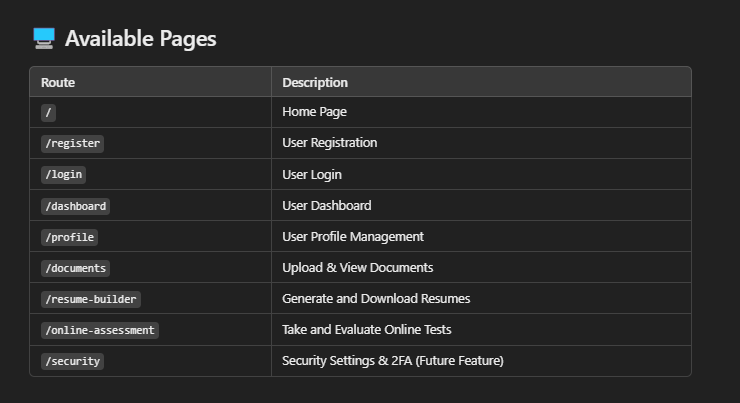

# 🆔 Citizen ID System

The **Citizen ID System** is a digital identity management platform that allows users to register, log in, manage profiles, upload documents, and take online assessments securely.

---

## 🚀 Features
✅ **User Authentication**: Secure registration and login system.  
✅ **Dashboard**: Users can view and update their profile information.  
✅ **Secure Document Storage**: Users can upload, manage, and view digital documents.  
✅ **DigiOne Integration**: Automatically fetches official documents from DigiOne.  
✅ **Resume Builder**: Allows users to generate and download resumes.  
✅ **Online Assessments**: Provides an interactive testing environment.  
✅ **Dark Mode Support** 🌙 for better visibility.  
✅ **Sidebar Toggle**: Dynamic sidebar for better navigation experience.  

---

## 🛠️ Tech Stack
### **Frontend**
- **Next.js** (React)
- **Tailwind CSS** (Styling)
- **Lucide-react** (Icons)
- **Shadcn/ui** (UI Components)

### **Backend**
- **Node.js** + **Express.js** (API Handling)
- **MongoDB / PostgreSQL** (Database)
- **NextAuth.js** (Authentication)
- **Firebase / AWS S3** (Document Storage)

### **Tools & Integrations**
- **ESLint & Prettier** (Code Formatting)
- **Vercel** (Deployment)
- **JWT Authentication** (Secure API access)

---

